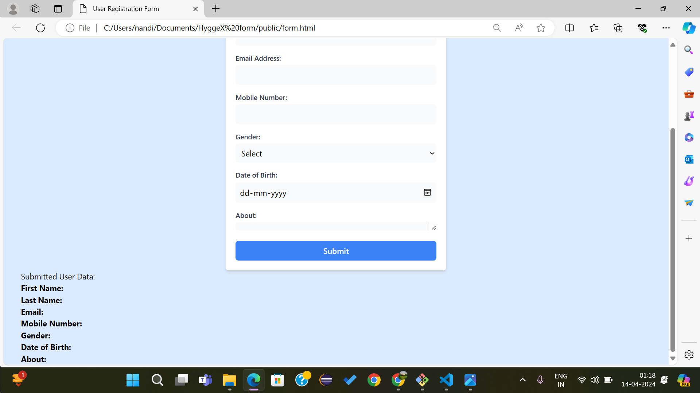

# user_form_registration
Frontend features:

    source folder: public (since html is a static language)
    minimal background,
    attributes: First Name, Last Name, email, Mobile, Date of birth, About(optional field).
    

Backend features:

    filename: server.js
    using express framework
    in memory databse created(i.e. data is stored in variables, not in Mongo db etc.)
    api registration created.

~ To use: 
    1. clone the repo
    2.node and express must be installed in your system
    3. Make sure the Localhost port number is not occupied. 
    4. Open server.js file in any terminal like VScode and then run command  'node server.js'